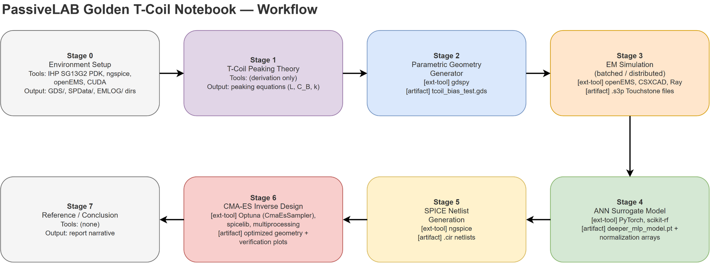
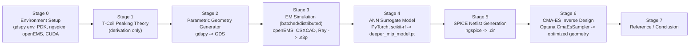

# Notebook Architecture Report

> **The Phase 1 sub-phase 1.0 deliverable** (`docs/PRD/Phase 1 — TCoil Platformization.md` §5–6:
> "Notebook architecture report — a workflow diagram with every cell categorized"). This report
> synthesizes all three 1.0 subtasks:
> - **1.0.1** — [`docs/NOTEBOOK_CELL_MAP.md`](NOTEBOOK_CELL_MAP.md): every cell mapped to a stage.
> - **1.0.2** — [`docs/TOOLS_AND_ARTIFACTS.md`](TOOLS_AND_ARTIFACTS.md): every tool/artifact,
>   produced/consumed.
> - **1.0.3** (this document): the workflow diagram, plus every cell explicitly classified
>   **reusable** vs. **hack** vs. **neutral** — the sub-phase's validation criterion.
>
> **Source:** `reference/jupyter/TCoil_Dataset_Generator_and_Training (1).ipynb` — 84 cells,
> 8 stages. All facts below are drawn from the two linked documents; no new notebook analysis
> was performed. Cite cell numbers per the citation rule; full per-cell detail lives in
> `NOTEBOOK_CELL_MAP.md`.

---

## 1. Workflow diagram

Editable source: [`assets/notebook-workflow-diagram.drawio`](assets/notebook-workflow-diagram.drawio) · also exported as [SVG](assets/notebook-workflow-diagram.svg).

Native Mermaid version (renders inline on GitHub, no external asset):

This is the golden pipeline `Parameters → Geometry(gdspy) → GDS → openEMS(EM) → Dataset(Ray)
→ ANN(MLP) → SPICE(ngspice) → CMA-ES inverse design` (`docs/PRD/Phase 1 — TCoil
Platformization.md` §1, Master Mode B).

## 2. Stage summary

| Stage | Cells | Purpose |
|---|---|---|
| 0 | 1–6 | Front matter, requirements, environment setup |
| 1 | 7 | T-coil peaking theory (motivates the whole design flow) |
| 2 | 8–10 | Parametric geometry generator (gdspy) |
| 3 | 11–16 | EM simulation + batched/distributed data generation |
| 4 | 17–34 | ANN-based surrogate model |
| 5 | 35–42 | SPICE netlist generation, active+passive co-simulation |
| 6 | 43–81 | Algorithm-based inverse design (2 worked examples) |
| 7 | 82–84 | Reference, conclusion, future work |

Full per-cell detail (type, line, summary, tags): [`NOTEBOOK_CELL_MAP.md`](NOTEBOOK_CELL_MAP.md).
Full tool/artifact inputs-outputs per stage: [`TOOLS_AND_ARTIFACTS.md`](TOOLS_AND_ARTIFACTS.md).

## 3. Reusable-vs-hack classification (all 84 cells)

Every cell, categorized. `reusable` = candidate for a Phase-1 core interface (PRD §4).
`hack` = notebook-specific workaround that platformization must **not** carry over as-is.
`neutral` = narrative/front-matter/transition/plot-only cell — neither.
Consecutive cells sharing a category are grouped into ranges; source: `NOTEBOOK_CELL_MAP.md`
`[reusable]`/`[hack]` tags.

| Cell(s) | Stage | Category |
|---|---|---|
| 1–2 | 0 | neutral |
| 3 | 0 | **hack** — declares the "copy cell into a standalone script" pattern (cell 3) |
| 4 | 0 | neutral |
| 5 | 0 | **hack** — manual PDK source patch required to run headless |
| 6 | 0 | neutral |
| 7 | 1 | neutral |
| 8 | 2 | neutral |
| 9 | 2 | **reusable + hack** — the full gdspy geometry generator (reusable core), but in-notebook execution is test-only and needs the `use_current_library=False` gdspy-bug workaround (hack) |
| 10 | 2 | **hack** — `gdspy.library.use_current_library=False` workaround, repeated 6× notebook-wide |
| 11 | 3 | **reusable** — `simulator_openems.py` → `SimulationBackend.characterize(layout)` |
| 12 | 3 | neutral |
| 13 | 3 | **reusable** — parameter-sampling logic feeds `DatasetPipeline` |
| 14 | 3 | **hack** — `emx_sim.py`, cluster-only execution, not runnable inline |
| 15–16 | 3 | neutral |
| 17–20 | 4 | neutral |
| 21 | 4 | **reusable** — `load_geometry`/`load_sparameters`/`normalize_array_columnwise` → `DatasetPipeline` |
| 22–23 | 4 | neutral |
| 24–25 | 4 | **reusable** — `Dataset`/`DataLoader` + `DeeperMLP` model definition → `ModelTrainer` |
| 26–27 | 4 | neutral |
| 28 | 4 | **reusable** — training loop → `ModelTrainer.train()` |
| 29 | 4 | neutral |
| 30–31 | 4 | **reusable** — validation metric + inference/prediction utilities (reused again in Stage 6) |
| 32–34 | 4 | neutral |
| 35–37 | 5 | neutral |
| 38 | 5 | **reusable** — `Write_Libs` netlist header writer |
| 39 | 5 | **hack** — S3P→SPICE `xfer`-based workaround (ngspice has no native S-parameter element) |
| 40 | 5 | **reusable** — netlist-writer helper functions |
| 41 | 5 | neutral |
| 42 | 5 | **reusable** — T-coil-augmented circuit builder, feeds the Stage 6 optimizer objective |
| 43–45 | 6 (ex.1) | neutral |
| 46 | 6 (ex.1) | **hack** — shells out to ngspice via `os.system`/subprocess prefix string |
| 47 | 6 (ex.1) | neutral |
| 48 | 6 (ex.1) | **reusable** — performance-metric functions → `Optimizer` objective terms |
| 49 | 6 (ex.1) | neutral |
| 50–53 | 6 (ex.1) | **reusable** — validity check, candidate-evaluation worker, `Optimizer.optimize(objective)`, main optimization loop |
| 54–56 | 6 (ex.1) | neutral |
| 57 | 6 (ex.1) | **reusable** — reuses the Stage 2 generator to regenerate optimized geometry |
| 58–59 | 6 (ex.1) | **hack** — repeats the gdspy `use_current_library` workaround |
| 60 | 6 (ex.1) | **reusable** — true EM+SPICE verification → `ValidationRunner.evaluate(candidate)` |
| 61–64 | 6 (ex.1) | neutral |
| 65–66 | 6 (ex.2) | neutral |
| 67 | 6 (ex.2) | **hack** — `Create_Test_Circuit` duplicated from cell 42 rather than reused |
| 68–69 | 6 (ex.2) | neutral |
| 70 | 6 (ex.2) | **hack** — near-duplicate of cell 53's optimization loop |
| 71–73 | 6 (ex.2) | neutral |
| 74–76 | 6 (ex.2) | **hack** — gdspy workaround + geometry regen duplicated from Example 1 |
| 77 | 6 (ex.2) | **reusable** — true EM+SPICE verification (mirrors cell 60) → `ValidationRunner` |
| 78–81 | 6 (ex.2) | neutral |
| 82–84 | 7 | neutral |

**Tally:** 19 reusable-only cells, 1 reusable+hack (cell 9), 12 hack-only cells, 52 neutral —
84 cells total, matching `NOTEBOOK_CELL_MAP.md`'s cell count.

## 4. Notebook-specific hacks — do-not-carry-over checklist

For sub-phase 1.2+ implementers (`docs/PRD/Phase 1 — TCoil Platformization.md` §5, sub-phases
1.2–1.8): these six patterns are notebook artifacts, not part of the reproducible methodology.

- [ ] **Copy-to-script cells** (9, 11, 14) — three cells are annotated "save as a separate
      script" and cannot run inside the notebook (distributed/cluster or non-interactive
      requirements). The platform must make these first-class callable functions
      (`LayoutGenerator`, `SimulationBackend`), not copy/paste instructions.
- [ ] **`gdspy.library.use_current_library = False`** — repeated 6× (cells 10, 58, 59, 74, 75,
      76) as a workaround for a known upstream gdspy bug. A platform `LayoutGenerator` must
      encapsulate this once, not rely on callers remembering it. (See also sub-phase 1.1:
      whether gdspy itself should be replaced.)
- [ ] **Manual PDK source patch** (cell 5; `modules/util_simulation_setup.py:312`) — a one-line
      edit required before simulations can run headless. Must become a documented/automated
      part of `SimulationBackend` setup.
- [ ] **Hardcoded local paths** (`data_path`, `sim_path`) — require per-user editing throughout.
- [ ] **Duplicated Inverse Design examples** (cells 43–64 vs. 65–81, 37 cells combined) —
      Example 1 and Example 2 duplicate almost the entire optimization pipeline with only the
      target structure changed, no shared function or parametrization. This is the clearest
      signal for why `Optimizer`/`ValidationRunner` (sub-phases 1.2, 1.7, 1.8) must be extracted
      as reusable APIs rather than copy-pasted per design point.
- [ ] **Dead commented-out plotting code** (cells 61–62, 78–79 region) — drop, don't port.

## 5. Reusable components → Phase-1 interface map

| Notebook source | Cells | → Phase-1 interface (PRD §4 / `docs/ARCHITECTURE.md`) |
|---|---|---|
| `tcoil_bias.py` generator functions (`CreateTCoilTraceVanilla`, `CreateViaArray`, `CreateGroundPlane`, `CreateOctagonPad`) | 9, 57, 74 | `LayoutGenerator.generate(spec)` (L3) |
| `simulator_openems.py` | 11 | `SimulationBackend.characterize(layout)` (L4–L5) |
| Data-loading / normalization / `Dataset` / `DataLoader` code | 21, 24 | `DatasetPipeline` (L6) |
| `DeeperMLP` + training loop | 25, 28 | `ModelTrainer` (L7) |
| SPICE netlist-writer functions | 38, 40, 42 | circuit-integration side of `Optimizer` (L9) |
| Optuna `CmaEsSampler` loop + `PerfCalc*` objective | 48, 50–53 | `Optimizer.optimize(objective)` (L8) |
| "True EM+SPICE verification" cells | 60, 77 | `ValidationRunner.evaluate(candidate)` (L10) |

## 6. Handoff

Sub-phase 1.0 is complete: every cell is mapped to a stage (1.0.1), every external tool and
generated artifact is inventoried with produced/consumed cross-references (1.0.2), and every
cell is classified reusable-vs-hack with an explicit do-not-carry-over checklist (1.0.3). The
seven reusable-component groups above give sub-phase 1.2 (core abstraction extraction) a
concrete starting inventory; the six flagged hacks give sub-phases 1.2–1.8 a checklist of
notebook-only behavior to deliberately not reproduce. Sub-phase 1.1 (generator investigation)
can also proceed independently — it decides whether cell 9's gdspy generator is kept or
replaced before extraction.

## Related

- [`docs/NOTEBOOK_CELL_MAP.md`](NOTEBOOK_CELL_MAP.md) — full per-cell detail (1.0.1).
- [`docs/TOOLS_AND_ARTIFACTS.md`](TOOLS_AND_ARTIFACTS.md) — tools/artifacts inventory (1.0.2).
- [`docs/ARCHITECTURE.md`](ARCHITECTURE.md) — the layered pipeline / stable core APIs referenced above.
- [`docs/PRD/Phase 1 — TCoil Platformization.md`](PRD/Phase%201%20—%20TCoil%20Platformization.md) §4–5 — interface table and sub-phase definitions.
