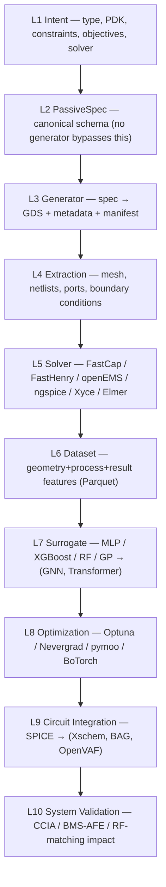

# PassiveLab — Master PRD

> **Purpose of this document.** This is the *complete, long-term* PRD for PassiveLab.
> It is the single source of truth for the vision, users, architecture, and roadmap.
> Each **phase PRD** (see `01 Phase Index & Roadmap.md`) implements one slice of this
> document and must trace its goals back here. When a phase and this master disagree,
> **this master wins** — the phase is behind and should be re-synced.
>
> This clean set is derived from two immutable sources in the parent folder
> (`Curated PRD.md` = complete brain-dump, `Platformization Detail PRD Phase 1.md` =
> phase-1 focus). Those are never modified; this folder is the clean, synchronized copy.

**One-liner.** PassiveLab is *OpenROAD for passive structures* — an open-source platform
that turns a passive **specification** into a generated, characterized, optimized, and
benchmarked layout, PDK-agnostic, with the research-platform clarity of OpenDPD.

---

## 1. Vision

PassiveLab is an open-source infrastructure platform for automated **generation,
characterization, optimization, and benchmarking** of passive structures for
semiconductor PDKs. The long-term goal is to **eliminate manual passive-cell creation and
characterization** for unsupported PDK primitives.

Instead of manually drawing and characterizing capacitors, inductors, transformers, and
resistors, the user defines a specification and PassiveLab automatically:

```
Generate geometry → Characterize performance → Store in reusable library
                  → Optimize structure → Benchmark optimization algorithms
```

PassiveLab aims to become for **passive structures** what OpenROAD became for digital
implementation, and what OpenDPD became for DPD benchmarking. It platformizes the
combination of the **tcoil inductor notebook** (golden reference, see [[DOC-tcoil-0001]]),
the **pcLab** inductor generator, and **OpenPCELL** generation, wrapped in a clean
research platform.

---

## 2. Problem

Open-source (and often closed-source) chip designers face:

- **Missing primitives.** Passive structures a circuit needs are not provided by the PDK
  — e.g. GF180MCU ships no inductors.
- **Slow characterization.** EM / TCAD / field solvers are notoriously slow, while the
  user wants to *state a spec → get a layout instantly → drop it into EDA as a PCell*.
- **No path from GDS to PCell.** There is no clean flow from a generated GDS to an
  EDA-usable PCell; today a designer hand-codes everything from geometry (gdstk) down to
  characterization.
- **Manual, spreadsheet-driven loop.** Draw layouts by hand → extract & characterize by
  hand → run parameter sweeps by hand → maintain spreadsheets by hand.

**No one is building open passive-structure generation as a platform.** That gap is the
product.

---

## 3. Users (three archetypes)

The platform must serve three archetypes; every feature should map to at least one.

| Archetype | Wants | Input | Output |
|---|---|---|---|
| **Analog / IC designer** | Drop an optimized passive into a circuit instantly | `target_value`, `max_area`, `min_voltage_margin` | Optimized, implementable passive (layout + PCell + model) |
| **Device researcher** | Sweep & characterize topologies, build datasets | Parameter sweep definition | Dataset, characterization + benchmark results |
| **Algorithm developer** | Benchmark optimization algorithms fairly | Optimization algorithm | Benchmark score vs. baseline methods |

---

## 4. Product scope

### 4.1 Core function
Produce an **automated, implementable passive structure**, free of DRC/LVS errors, with
**accurate characterization** that is validated against slow reference solvers
(FastCap, openEMS, FastHenry, etc.).

### 4.2 Full capability set (long-term)
- Define passive requirements instead of drawing layouts.
- Generate GDS automatically.
- Evaluate performance with open-source solvers.
- Build datasets automatically.
- Train surrogate models automatically.
- Optimize passive structures automatically.
- Insert generated passives into larger circuits.
- Validate system-level performance automatically.

### 4.3 First two targets
Platformize **tcoil first, then MOM cap**. MOM cap adds a high-voltage-compliance goal:
estimate **E_max** and **V_br** to reach HV-compliant MOM capacitors. Beyond these, the
platform must support many passive types (spiral inductor, transformer, resistor, …),
multiple extraction engines (openEMS, FastHenry, FastCap, fdtdx, …), multiple optimizers,
and multiple benchmark suites — **PDK-agnostic** throughout.

### 4.4 Solution characteristics (the "feel")
- **Zero-hassle setup** — one library, `requirements.txt` served, everything packed
  (OpenDPD-style); geometry specified more formally than pcLab or the tcoil notebook did.
- **Lightweight & fast** — generate → estimate → target → optimize → inverse-design →
  integrate → PCell, all fast.
- **Human-friendly *and* AI-friendly** at the same time.
- **Modular** — user picks which steps to run (OpenDPD-style step selection).
- **PDK-agnostic** and **configurable** (GUI or CLI).

---

## 5. Prior art (living references)

- **pcLab** — passive component layout generator; a base concept.
- **OpenPCELL** — parametric PCell layout generator (auto-PCell target).
- **tcoil notebook** ([[DOC-tcoil-0001]]) — the **golden**, most complete/compact
  reference; already digested into KB claims & concepts, but still a notebook (unplatformized).
- **OpenROAD / ORFS / OpenFASOC** — script→GDS that is DRC/LVS-clean with an extraction
  flow. *We cannot use RTL for passives* — PDK-agnostic geometry comes via gdstk/gdspy.
- **OpenDPD** — the research-platform philosophy: clean, fair algorithm benchmarking.

---

## 6. Architecture

### 6.1 Layered pipeline
The system is a stack of layers; **no layer may bypass the one below it**, and
**no optimization module may bypass characterization**.



Per-layer intent (condensed; full detail lives per phase):

- **L1 Intent** — user states passive type, PDK, constraints, objectives, solver choice.
- **L2 PassiveSpec** — one canonical schema; every passive is a `PassiveSpec`. No bypass.
- **L3 Generator** — backends `gdstk` / `glayout` / OpenFASOC / custom; all implement
  `generate(spec) → {GDS, metadata, parameter manifest}`.
- **L4 Extraction** — prepare simulation inputs (mesh, netlists, ports, BCs).
- **L5 Solver** — plugin architecture; all implement `simulate(job) → SimulationResult`.
  Electrostatic FastCap · Magnetic FastHenry · EM openEMS · Circuit ngspice/Xyce ·
  Field Elmer FEM · Future DEVSIM.
- **L6 Dataset** — reusable datasets (geometry / process / result / metric features).
  **Parquet preferred; no CSV except debugging.**
- **L7 Surrogate** — replace expensive sims (MLP, XGBoost, RF, GP → GNN, Transformer).
- **L8 Optimization** — explore design space; targets include capacitance, ESR, Q, area,
  E_max, HV score, custom objectives.
- **L9 Circuit Integration** — insert generated passive into a circuit (SPICE now →
  Xschem/BAG/OpenVAF later).
- **L10 System Validation** — measure top-level impact (gain, noise, BW, stability,
  power) via CCIA / BMS-AFE / RF-matching.

### 6.2 Stable core APIs (must not break)
```
Geometry:        generate(spec)     -> Layout
Characterization: characterize(layout) -> Metrics
Optimization:    optimize(objective) -> Candidate
Benchmark:       evaluate(candidate) -> Score
```
These four interfaces are the platform contract. Everything else is a plugin behind them.

### 6.3 Plugins & applications
- **Plugins** — MOMCap · SpiralInductor · Transformer · Resistor.
- **Applications** — CCIA Benchmark · BMS-AFE Benchmark · RF-Matching Benchmark.

### 6.4 PassiveCharLib (the primary asset)
`PassiveCharLib` stores: geometry parameters · layout metadata · capacitance · area ·
ESR · frequency response · extraction metadata · simulator metadata. **The characterized
library, not any single generator, is the durable value of the project.**

### 6.5 Operating modes
- **Mode A — Library Generation.** `Target passive → Generate layout → Generate symbol →
  Generate SPICE`. Equivalent to building a new PCell library.
- **Mode B — Circuit Optimization.** `Import netlist → Identify passives → Link surrogate
  models → Optimize`. Equivalent to the tcoil (ETH) notebook flow.

---

## 7. Build philosophy

**Always integrate existing tools before building new ones.** Priority order:

1. Reuse existing OSS tools.
2. Wrap existing APIs.
3. Build adapters.
4. Build new tools **only when unavoidable**.

Corollary governance (from the curated agentic markdowns):
- **Dependency rule** — Optimization → may call Characterization → may call Geometry;
  Geometry may **not** call Optimization.
- **Do not** add new frameworks, duplicate functions, or change public interfaces.
- **Always** write tests, update docs, reuse existing modules.

---

## 8. Benchmark philosophy

Every optimization algorithm is evaluated through **benchmark tasks** — this is the
OpenDPD-style fairness contract.

> **Example — CCIA Input Capacitor Benchmark.** Objectives: maximize capacitance,
> minimize area. Constraints: minimum voltage margin, minimum matching quality.
> Output: a single benchmark score. No algorithm may skip characterization to score.

---

## 9. Repository structure (target)

```
passivelab/
  core/        geometry/  characterization/  optimization/  benchmark/
  plugins/     momcap/  inductor/  transformer/
  datasets/
  benchmarks/  ccia/  bms/
  notebooks/
  tests/
  docs/        VISION.md  ARCHITECTURE.md  ROADMAP.md  AGENTS.md
  utils/  config/  scripts/
```

**Agentic docs the repo carries:**
- `AGENTS.md` — mission, current milestone, do/don't, architecture dependency rule.
- `ARCHITECTURE.md` — the dependency rules in §7.
- `ROADMAP.md` — the roadmap in §10.
- **CI philosophy** — every PR runs: `lint` · `unit tests` · `example notebook` ·
  `golden-layout regression`. Golden data (e.g. `golden_data/momcap_reference.json`)
  pins reproducibility.

---

## 10. Roadmap — the long-term goals every phase serves

This is the spine. Each **phase PRD implements one row** and must cite the master goal(s)
it advances. (See `01 Phase Index & Roadmap.md` for the phase↔version mapping + status.)

| Version | Milestone | Long-term goal it advances |
|---|---|---|
| **v0.0** | **TCoil platformization** | Prove the platform reproduces the golden notebook through reusable APIs (infrastructure) |
| **v0.1** | **MOMCap** | First *new* passive on the shared interfaces + HV compliance (E_max, V_br) |
| **v0.2** | **PassiveCharLib** | The reusable characterized-library asset (§6.4) |
| **v0.3** | **CCIA Benchmark** | System-level validation loop (L10) + benchmark fairness (§8) |
| **v0.4** | **Bayesian Optimization** | Pluggable optimizers on the benchmark harness |
| **v0.5** | **ANN Surrogate (general)** | Surrogate layer generalized beyond tcoil |
| **v1.0** | **Inductor Plugin** | Multi-passive proof; interfaces hold across types |

### Success metrics
- **v0** — generate a MOM cap automatically · characterize automatically · optimize
  automatically · demonstrate improvement inside CCIA.
- **v1.0** — support multiple passive types.
- **v2.0** — support multiple PDKs.
- **v3.0** — support benchmarking of optimization algorithms.

> **Note on numbering.** The version roadmap (v0.0…) and the PRD "phase" numbering are
> aligned but not identical granularity: Phase 1 delivers **v0.0**, Phase 2 delivers
> **v0.1** (MOMCap **and** its HV-compliance stretch). Later phases map v0.2→v1.0 as the
> index enumerates.

---

## 11. Long-term invariants (what phases must never violate)

1. **PassiveSpec is the only entry to generation.** No generator bypasses L2.
2. **No optimization without characterization.** L8 always goes through L5/L6.
3. **The four core APIs (§6.2) are stable.** Extend via plugins, don't fork interfaces.
4. **Reuse-first (§7).** New code only when unavoidable.
5. **PDK-agnostic.** No PDK-specific assumption leaks into core.
6. **Human-first & AI-friendly.** Everything specifiable and readable without the tool.

---

## Related

- `01 Phase Index & Roadmap.md` — phase↔version map + status
- `Phase 1 — TCoil Platformization.md` — v0.0 (reproduce the golden notebook)
- `Phase 2 — MOMCap & HV Compliance.md` — v0.1
- Golden reference: [[DOC-tcoil-0001]] · claims `300 digest/Claims/DOC-tcoil.jsonl`
- Concepts: [[T-Coil Peaking]] · [[Passive-Active Co-Design Workflow]] ·
  [[ANN Surrogate Model]] · [[CMA-ES Inverse Design]] · [[EM Simulation]]
